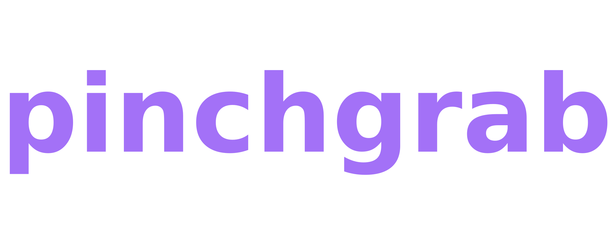
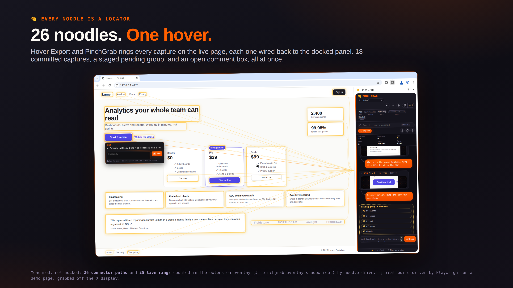
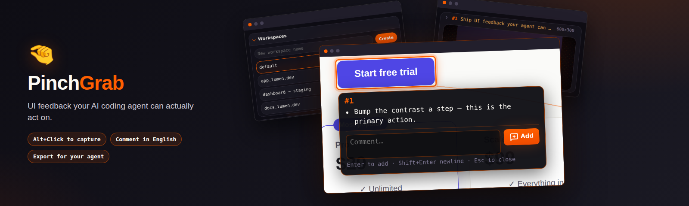
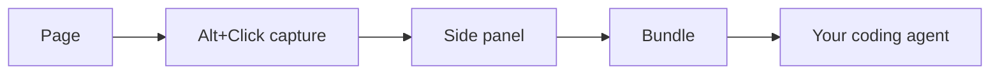
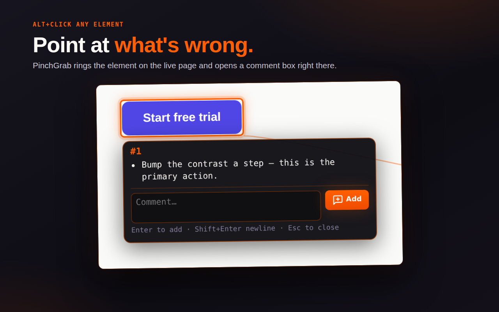
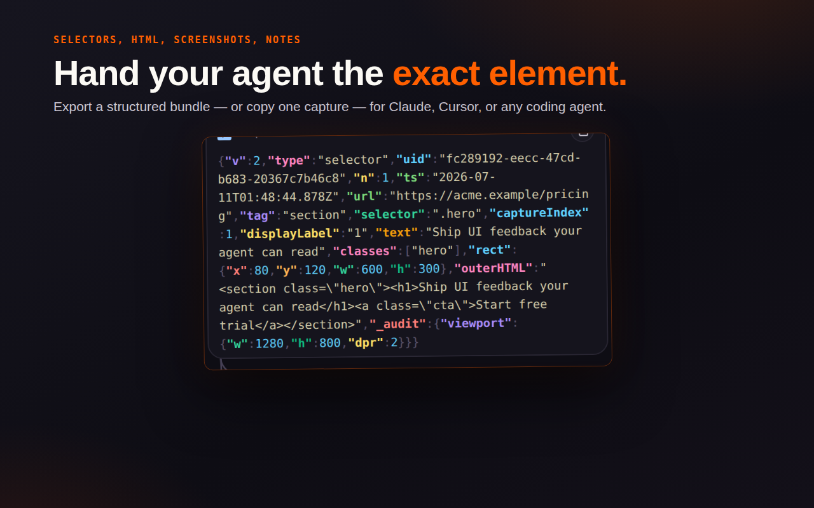

<div align="center">
<picture>
  <source media="(prefers-color-scheme: dark)" srcset="docs/brand/pinchgrab-wordmark-dark.png">
  <source media="(prefers-color-scheme: light)" srcset="docs/brand/pinchgrab-wordmark-light.png">
  
</picture>

#### element capture · inline review comments · per-tab workspaces · agent-ready export bundles · replay and visual-diff CLI

# Hand your AI coding agent the exact element

**[Quick start](#-quick-start) | [Features](#-features) | [Developer install](#-developer-install) | [AI coding agents](#-ai-coding-agents-claude-code-cursor-codex) | [vs Claude Design](#-pinchgrab-vs-claude-design) | [Privacy](docs/PRIVACY.md) | [Deployment guide](docs/BROWSER-EXTENSION-DEPLOYMENT.md) |**

<a href="https://chromewebstore.google.com/detail/pinchgrab/jenjnicjfmgbddgconejmjhmdfphhlji"></a>

[](https://chromewebstore.google.com/detail/pinchgrab/jenjnicjfmgbddgconejmjhmdfphhlji) [](https://chromewebstore.google.com/detail/pinchgrab/jenjnicjfmgbddgconejmjhmdfphhlji) [](https://chromewebstore.google.com/detail/pinchgrab/jenjnicjfmgbddgconejmjhmdfphhlji)

**❤️ [Sponsor this project](https://github.com/sponsors/wranngle) ❤️**

[](LICENSE)
[](https://github.com/wranngle/pinchgrab/releases)
[](https://github.com/wranngle/pinchgrab/actions/workflows/ci.yml)
[](https://github.com/wranngle/pinchgrab/commits/main)
[](https://github.com/wranngle/pinchgrab/graphs/contributors)

[](https://github.com/wranngle/pinchgrab/stargazers)
[](https://github.com/wranngle)
</div>

---




*26 live connector noodles from one session ([counts](docs/brand/noodle-festival-measurements.json)).*

Instead of screenshotting a broken page and describing it by hand, hold Alt, click the element, and say what's wrong in a comment beside the capture. Each capture pins the exact element for a coding agent: URL, viewport, DOM context, component hints, accessibility signals, event hints, and sanitized HTML. On export, **PinchGrab** writes the whole per-tab workspace to `Downloads/pinchgrab/<workspace>/` as JSONL and a `.tar.zst` bundle an agent can act on **directly**.

Exports are boring, open formats: newline-delimited JSON you can query with DuckDB, PNG screenshots with a JSON index, and a JSON-Schema for every row type, all wrapped in one `.tar.zst` a coding agent reads without ever seeing this repo.

## 🤏 One pinch replaces the whole copy-paste loop

You already know the loop, and you resent it: one wrong element stands behind a screenshot, a crop, an arrow, an upload, a paragraph explaining which button you mean, and a DevTools dig for a selector the agent will still second-guess. Then again for the next element. PinchGrab exists to murder that workflow.

| Manual loop, repeated **per element** | PinchGrab, **one pass per workspace** |
| --- | --- |
| 1. Screenshot the page | 1. Hold <kbd>Alt</kbd>, click the element |
| 2. Crop to the element | 2. Type the complaint in the box beside it |
| 3. Annotate an arrow so the model can find it | 3. Repeat the pinch for anything else that bugs you |
| 4. Upload the image to the chat | 4. Click **Export** once |
| 5. Describe the element in words anyway | |
| 6. Dig the selector out of DevTools | |
| 7. Paste selector and hope it still resolves | |
| **7 steps × N elements, and the pairing between image, words, and selector lives only in your prose** | **1 gesture per element + 1 export, and every comment ships already welded to its exact locator and screenshot** |

The step counts above are workflow facts you can count on your fingers. The density is where the numbers live: each capture row carries validated selectors, sanitized depth-capped HTML, accessibility signals, and framework component hints. Across the 12-framework tour, capture HTML minifies to a mean 29.2% below the raw markup (47.6% smaller byte-weighted across all 467 captures), and a full workspace bundle lands at a mean 31.6 KB without screenshots, 984.9 KB with them.

## ⚡ Features



- 🤏 **Alt+Click capture**: hold `Alt` to outline any element, click to capture its selectors, DOM breadcrumb, computed styles, accessibility tree, and framework component hints in one record.

- 🤏 **Inline comments**: say what's wrong in plain English right beside the capture; every note stays paired to the exact element it describes, screenshot included.

- 🤏 **Per-tab workspaces**: each activated tab gets its own workspace, so you can critique several sites at once without mixing feedback.

- 🤏 **Export bundle**: one click writes the whole workspace to `Downloads/pinchgrab/<workspace>/` as JSONL, full-resolution screenshots, a `screenshots.json` index, `schema.json`, DuckDB recipes, and a single `.tar.zst` archive.

- 🤏 **Send to Agent**: one click exports the bundle *and* copies a paste-ready JSONL prompt — bootstrap script, read list, work protocol — so Claude Code, Cursor, or any coding agent starts fixing without extra prompting; a `recapture` CLI lets the agent re-audit its own fixes against your comments.

- 🤏 **Replay and diff CLI**: replay captures, generate visual diffs, replay network activity, annotate steps, and export to Playwright, Puppeteer, or plain-English recipes.

- 🤏 **Store-grade screenshot tooling**: the Chrome Web Store listing set is composed from real panel captures, so listing assets regenerate from source instead of rotting.

## 📏 The token receipt

- 🤏 **95.3% smaller than pasting the page.** The rendered DOM of the 12 pages serializes to 6,222 KB of HTML; the minified JSONL exports total 292.5 KB. In estimated tokens (bytes/4 heuristic) that is 1,592,924 → 74,888.
- 🤏 **87.4% smaller on container grabs.** The 40 captures whose raw markup is 4 KB or more, the sections and cards people actually pinch, went from 355.5 KB raw to 44.8 KB of minified rows.
- 🤏 **Every capture is a bounded ~632 byte row** no matter how deep the subtree underneath it goes, so a grabbed dashboard never arrives as 25 KB of sparkline spans.
- 🤏 **A text-only feedback bundle averages 31.6 KB on disk**; with a full-resolution PNG of every captured element it averages 984.9 KB.

## 🧭 What PinchGrab is — and is not

PinchGrab is deliberately **not** another "chat with an AI until an app falls out" tool. It is the feedback half of the loop, built for people who already have a real app and an agent they trust:

- **Point, don't prompt.** Annotate the live UI by typing — or dictating with your OS voice input — right beside the exact element. No waiting for a model turn between comments, no switching interfaces mid-thought.
- **Completely model-agnostic.** The export is plain files. Claude, GPT, Gemini, a local model: anything that reads files can work the bundle.
- **Any agent harness, zero ceremony.** Claude Code, Cursor, Codex, Copilot, or your own scripts consume the bundle as-is. Nothing to install into the harness, nothing to upgrade, maintain, or refactor when the harness changes.
- **Works on whatever your browser can reach.** Localhost, staging, production, an intranet app, someone else's site — if the page renders, you can pinch it.
- **It never tries to develop your app for you.** PinchGrab captures intent with surgical context and hands off; your agent and your toolchain do the work where the code actually lives.

## 🚀 Quick start

### Install from the Chrome Web Store

**[Add PinchGrab to your browser](https://chromewebstore.google.com/detail/pinchgrab/jenjnicjfmgbddgconejmjhmdfphhlji)** works in Chrome, Edge, Brave, Arc, Opera, and other Chromium browsers.

Pin PinchGrab, open any page, then hold `Alt` to inspect and `Alt+Click` to capture. That is the whole loop; the diagram shows the full path a capture travels.



### Make your first capture

1. Hold `Alt` to outline elements, then `Alt+Click` the one that's wrong.
2. Type what's wrong in the comment box right beside the element.
3. Export the workspace from the side panel when the critique is done.

#### 🤏 Shortcuts

While your fingers are on <kbd>Alt</kbd>, here is the rest of the hand. On the page:

| Keys | Action |
| --- | --- |
| <kbd>Alt</kbd> (hold) | Peek: outline the element under the cursor, no capture |
| <kbd>Alt</kbd> + Click | Capture the element into the workspace |
| <kbd>Alt</kbd> + <kbd>Shift</kbd> + Click | Stage the element into the pending bay (commit later) |
| <kbd>Alt</kbd> + drag | Rubber-band: stage every element inside the rectangle |

In the side panel:

| Keys | Action |
| --- | --- |
| <kbd>Ctrl</kbd>/<kbd>Cmd</kbd> + <kbd>K</kbd> | Open or close the command palette |
| <kbd>Ctrl</kbd>/<kbd>Cmd</kbd> + <kbd>Z</kbd> | Undo |
| <kbd>Ctrl</kbd>/<kbd>Cmd</kbd> + <kbd>Shift</kbd> + <kbd>Z</kbd> or <kbd>Ctrl</kbd> + <kbd>Y</kbd> | Redo |
| <kbd>Ctrl</kbd>/<kbd>Cmd</kbd> + <kbd>F</kbd> | Find within the panel |

> Typing `> selector` into the composer runs a manual capture by CSS selector. It is a composer command, not a keybinding, and it is also reachable from the palette.

Everything lands under your Downloads folder:

| Artifact | Path |
| --- | --- |
| Workspace bundle | `Downloads/pinchgrab/<workspace>/<workspace>.tar.zst` |
| Raw capture stream | `Downloads/pinchgrab/<workspace>/<workspace>.jsonl` |
| Screenshots | `Downloads/pinchgrab/<workspace>/screenshots/` plus a `screenshots.json` index |

> 💡 Info: every row type in the stream is described by a JSON-Schema. The older standalone capture schema lives at [docs/capture-schema.json](docs/capture-schema.json), with samples in [docs/capture-sample.jsonl](docs/capture-sample.jsonl).

#### Example

---

<details>
  <summary>What one capture row looks like (real row from <code>docs/capture-sample.jsonl</code>)</summary>

  ```json
  {"schema":"selector-capture-entry","version":3,"sequence":1,"capturedAt":"2026-05-14T17:02:11.482Z","page":{"title":"Pricing — Acme","url":"https://acme.test/pricing","origin":"https://acme.test","protocol":"https:","path":"/pricing","search":"","hash":"","route":"/pricing","viewport":{"width":1440,"height":900,"devicePixelRatio":2,"colorScheme":"light","reducedMotion":false},"scroll":{"x":0,"y":240},"language":"en","direction":"ltr","charset":"UTF-8","documentState":"complete","referrer":"https://acme.test/","contentType":"text/html"},"selectors":{"compact":"button[data-testid=cta-upgrade]","css":"main > section.pricing > div.plan--pro > button[data-testid=\"cta-upgrade\"]","xpath":"//main/section[2]/div[2]/button","jsPath":"document.querySelector(\"[data-testid='cta-upgrade']\")","domPath":["main","section.pricing","div.plan--pro","button"],"siblingIndex":3,"nodeIndex":0,"id":null,"classes":["btn","btn--primary"],"dataIds":"cta-upgrade"},"componentRoot":{"compact":"section.pricing","css":"main > section.pricing","xpath":"//main/section[2]","tag":"section","id":null,"role":null,"testId":null,"classes":["pricing"]},"component":{"framework":"react","componentName":"UpgradeButton","componentDisplayName":"UpgradeButton","source":{"file":"src/components/UpgradeButton.tsx","line":42,"column":4},"props":{"variant":"primary","planId":"pro_monthly"},"state":null,"hooks":null},"element":{"tag":"button","id":null,"classes":["btn","btn--primary"],"name":null,"testId":"cta-upgrade","role":null,"type":"button","title":null,"alt":null,"href":null,"src":null,"target":null,"placeholder":null,"aria":{"aria-label":"Upgrade to Pro"},"value":null,"text":"Upgrade to Pro","accessibleName":"Upgrade to Pro","accessibility":{"computed":{"explicitRole":null,"explicitName":"Upgrade to Pro","computedRole":"button","ariaLive":null,"ariaChecked":null,"ariaExpanded":null,"ariaSelected":null,"tabIndex":0,"labelledBy":null,"describedBy":null,"hasPopup":null,"level":null,"controls":null},"nativeSnapshot":null},"isInteractive":true,"isEditable":false,"isDisabled":false,"isRequired":false,"validation":{"minLength":null,"maxLength":null,"min":null,"max":null},"relation":{"parent":{"tag":"div","id":null,"role":null},"siblingIndex":3,"childElementCount":0,"nodeIndex":0,"previousSibling":"p.plan__blurb","nextSibling":null},"dataset":{"testid":"cta-upgrade","plan":"pro"},"attrs":{"class":"btn btn--primary","data-testid":"cta-upgrade","data-plan":"pro","type":"button"},"outerHTML":"<button class=\"btn btn--primary\" data-testid=\"cta-upgrade\" data-plan=\"pro\" type=\"button\">Upgrade to Pro</button>","outerHTMLLength":108,"rect":{"x":612,"y":488,"width":196,"height":44,"top":488,"left":612,"right":808,"bottom":532},"bounds":{"viewportRect":{"x":612,"y":488,"width":196,"height":44,"top":488,"left":612,"right":808,"bottom":532},"screenRect":{"x":612,"y":728},"offsetSize":{"width":196,"height":44},"clientSize":{"width":196,"height":44},"scroll":{"left":0,"top":240},"viewport":{"width":1440,"height":900},"isInViewport":true,"partiallyVisible":false}},"styles":{"computed":{"color":"rgb(255, 255, 255)","background-color":"rgb(255, 95, 0)","font-size":"15px","font-weight":"600","border-radius":"4px","padding":"10px 18px"},"computedTail":{"display":"inline-flex","cursor":"pointer"},"customProperties":{"--brand-orange":"#ff5f00"},"pseudoStyles":{"before":{},"after":{},"marker":{}},"boxModel":{"width":"196px","height":"44px","minWidth":"0px","minHeight":"0px","maxWidth":"none","maxHeight":"none","margin":{"marginTop":"0px","marginRight":"0px","marginBottom":"0px","marginLeft":"0px"},"padding":{"paddingTop":"10px","paddingRight":"18px","paddingBottom":"10px","paddingLeft":"18px"},"border":{"borderTopWidth":"0px","borderRightWidth":"0px","borderBottomWidth":"0px","borderLeftWidth":"0px"}},"inlineStyle":{},"matchedRules":[{"selector":".btn--primary","specificity":null,"declarations":{"background-color":"rgb(255, 95, 0)","color":"rgb(255, 255, 255)"},"media":"","source":{"styleSheetHref":"https://acme.test/static/app.css","styleSheetType":"LINK","styleSheetId":null,"media":null,"origin":"author","selectorText":".btn--primary","ruleIndex":"42","sourceLine":null,"cssText":".btn--primary { background-color: #ff5f00; color: #ffffff; }","hasStyleText":true},"declarationPriority":[],"isInlineStyleRule":false,"selectorText":".btn--primary"}]},"states":{"hover":false,"focus":false,"focus-visible":false,"active":false,"checked":false,"disabled":false,"required":false,"invalid":false,"isVisible":true,"isEnabled":true},"events":{"inline":{},"propertyAssigned":[{"type":"onclick","assigned":true,"handlerName":"handleUpgradeClick"}],"devtoolsListeners":null,"handlerPropNames":[]},"domBreadcrumb":[{"depth":1,"tag":"html","compact":"html","id":null,"role":null,"classes":[]},{"depth":2,"tag":"body","compact":"body","id":null,"role":null,"classes":[]},{"depth":3,"tag":"main","compact":"main","id":null,"role":null,"classes":[]},{"depth":4,"tag":"section","compact":"section.pricing","id":null,"role":null,"classes":["pricing"]},{"depth":5,"tag":"div","compact":"div.plan--pro","id":null,"role":null,"classes":["plan--pro"]},{"depth":6,"tag":"button","compact":"button[data-testid=cta-upgrade]","id":null,"role":null,"classes":["btn","btn--primary"],"testId":"cta-upgrade"}],"notes":{"url":"https://acme.test/pricing"},"feedback":""}
  ```

  One newline-delimited row: an Alt+Click on a pricing-page button, carrying its selectors, React component source hints, accessibility tree, computed styles, and matched CSS rules. An agent or DuckDB reads the stream one row at a time; full schema at [docs/capture-schema.json](docs/capture-schema.json).

</details>

---

## 🔧 Developer install

Prefer to build from source? Load the unpacked extension. A packaged zip ships with each [release](https://github.com/wranngle/pinchgrab/releases), and the store-submission path lives in the [submission checklist](docs/RELEASE-CHECKLIST-CWS.md).

### Clone and build

1. Clone the repository

   ```bash
   git clone https://github.com/wranngle/pinchgrab && cd pinchgrab
   ```

2. Install dependencies and build the extension

   ```bash
   bun install
   bun run build
   ```

### Load the extension

1. Open `edge://extensions` or `chrome://extensions`.
2. Enable Developer mode.
3. Click **Load unpacked**.
4. Select the repo's `extension/` folder.
5. Pin PinchGrab, open a page, then hold `Alt` to inspect and `Alt+Click` to capture.

### Rebuild, test, and iterate

Day to day: rebuild, prove it still works, and serve pages to capture against:

```bash
bun run build       # rebuild extension/ from src/
bun run test        # full suite: build, static checks, every spec, CLI tests
bun run test:fast   # same suite without the CLI utility tests
bun run devserver   # local static server
```

When you changed one thing, check one thing:

```bash
bun run typecheck        # tsc --noEmit
bun run lint             # xo
bun run test:extension   # extension spec only
bun run test:exports     # export spec only
bun run test:legacy      # schema, replay, export, visual-diff, network-replay, annotator tests
```

The CLI utilities keep one entry point per replay and export task, covering Playwright and Puppeteer script export, plain-English recipes, visual diffs, network capture, and step annotations:

```bash
bun run replay
bun run replay:multi
bun run export:playwright
bun run export:puppeteer
bun run export:english
bun run visual-diff
bun run network-capture
bun run annotator
```




*Store listing frames, composed from real extension UI.*

## 🤏 What is in the bundle (and why)

One export writes one folder and one archive. The manifest is not a separate file; it is the leading row of the JSONL, so the stream carries its own inventory.

🤏 **`<workspace>.jsonl`** is the source of truth: a leading `manifest` row (version, tool, counts, hosts, and an `archiveIntegrity` file list with sizes), then per-page header rows, then one row per capture, comment, and group, each with selectors, sanitized `outerHTML`, and the user's comments.

🤏 **`AGENT-PROTOCOL.md`** is the agent's working doctrine: the map → plan → implement → audit → verify phases, the `~/.pinchgrab` persistence layout, the work-manifest row schemas, and the recapture verification loop — everything the clipboard prompt says, expanded, so a lost clipboard costs nothing.

🤏 **`repair-index.md`** is the punch list: one `### F001` section per complaint with target selector, uid, accessible name, selector-match count, screenshot path, component source hints, ancestor chain, and a heuristic fix category.

🤏 **`README.md`** (the bundle's own) is the entry point: counts, file list, three extraction fallbacks, a DuckDB starter, and a pointer to the triage materials.

🤏 **`screenshots/*.png`** are full-resolution PNGs of each captured element, group, and page, deduplicated by filename.

🤏 **`screenshots.json`** is the lookup layer over those PNGs: `byUid[uid]`, `byUrl[url]`, and a flat `files[]` list, so an agent resolves any row to its image without globbing.

🤏 **`duckdb.sql`** is copy-and-paste recipes for the questions a repair workflow actually asks: captures per host, duplicate `outerHTML`, missing screenshots, class-token frequency, comments joined to their parent selector.

🤏 **`schema.json`** is a machine-readable JSON-Schema (draft 2020-12) describing every row type, so strict consumers can validate before they trust.

🤏 **`skills-index.json`** maps every bundled skill document to its archive path, a one-line purpose, and its upstream source (repo + pinned commit), so an agent routes each comment to the right skill without guessing.

🤏 **Bundled design skills** ride in every archive: 32 impeccable reference guides under `.agents/skills/impeccable/reference/` (Apache-2.0, from [pbakaus/impeccable](https://github.com/pbakaus/impeccable)) and the complete Perception-First Design framework under `perception-first-design/` (CC BY-SA 4.0, from [skovalik/perception-first-design](https://github.com/skovalik/perception-first-design)), each with its upstream license and notices intact. Agents read them from the export — nothing gets installed.

🤏 **`DESIGN.md`** and **`.agents/skills/PinchGrab/SKILL.md`** ride along when configured, so the agent snaps visual fixes to your tokens instead of inventing its own taste.

🤏 **`pages/*.html`** (opt-in) is the full serialized HTML of each captured page, collected from the live tab at export time.

🤏 **`<workspace>.tar.zst`** wraps the lot into a single archive; the bundled README documents an extraction ladder from `tar --zstd` down to a pure-Node fallback.

One shipped recipe, verbatim (recipe 4):

```sql
SELECT n, url, selector
FROM pg
WHERE type = 'selector' AND screenshot IS NULL
ORDER BY n;
```

## 🤖 AI Coding Agents (Claude Code, Cursor, Codex)

Every `.tar.zst` export is handed to a **coding agent** as-is. There is no plugin, no API, and no server side; the bundle is the whole interface, and anything that can read files can consume one.

### Paste the prompt

**Send to Agent** copies a complete JSONL prompt to your clipboard alongside the export: the archive path, an idempotent bootstrap script that extracts into `~/.pinchgrab/workspaces/<workspace>/`, a mandatory read list, the bundle tree, and the full work protocol. Paste it into any coding agent and the loop starts itself.

### Or extract by hand

```bash
tar --zstd -xf <workspace>.tar.zst   # unpack next to (or inside) the project the feedback is about
```

The bundle's own `README.md` sends the agent to `AGENT-PROTOCOL.md` first — phases (map → plan → implement → audit → verify), the persistence layout, and the skill inventory — with `repair-index.md` as the per-comment punch list. No prompting is required beyond "read this folder and do what it describes".

### Work the repair index

`repair-index.md` turns each comment into a task: the complaint verbatim, the target selector and uid, the screenshot path, component and source-file hints when detected, and a heuristic fix category (copy, layout, accessibility, state, visual polish). The agent cross-references the JSONL and `screenshots/`, makes the fix, and verifies against the captured before-state.

### Close the loop

When the fixes land, the agent re-audits its own work with the same locator machinery the extension uses:

```bash
npx -y pinchgrab recapture <extracted>/<workspace>.jsonl http://localhost:3000 \
  --workspace-dir ~/.pinchgrab/workspaces/<workspace>
```

Every commented selector is re-located (CSS → XPath → accessibility fallback), screenshotted, and written to an append-only `recaptures/<runId>/` for before/after comparison against the bundle's original `screenshots/`.

## 🥊 PinchGrab vs Claude Design

Anthropic's [Claude Design](https://www.anthropic.com/news/claude-design-anthropic-labs) generates new mockups, prototypes, and decks inside claude.ai. PinchGrab points the other direction: it captures feedback on the UI you already shipped and hands it to whatever agent maintains the real code. Where the goal is "get my UI feedback into a coding agent", here is how they differ:

| | PinchGrab | Claude Design |
| --- | --- | --- |
| Works on | Any page your browser renders: localhost, staging, production, third-party sites | Generated mockups and prototypes inside claude.ai |
| Output | Element-exact feedback bundle: validated selectors, sanitized HTML, screenshots, your comments | New design artifacts (HTML, PDF, PPTX, Canva), plus a handoff bundle for Claude Code |
| Edits your codebase | Through *your* agent, in *your* repo | No — hands off to Claude Code for implementation |
| Model | Any — the bundle is plain files | Claude models only |
| Agent harness | Any that reads files; nothing to install, upgrade, or maintain | Claude ecosystem (claude.ai → Claude Code) |
| Signal-to-noise | Bounded ~632-byte capture rows; 95.3% smaller than pasting the page | Full generated pages per iteration |
| Messy, poorly-selectored UI in large apps | Spoonfed: validated selectors, component source hints, and ancestor chains welded to every complaint | You describe it; the model regenerates its own version |
| Pace of a review pass | Annotate as fast as you can Alt+Click and type — no model turn between comments | Conversational; each revision is a model turn |
| Prompt refinement | `AGENT-PROTOCOL.md` work phases, `repair-index.md` punch list, per-comment skill mapping, `DESIGN.md` token grounding | Prompt-driven |
| Multi-site review | Per-tab workspaces keep critiques separate | Per-conversation |
| Replay and verification | `recapture`, replay, visual-diff, and Playwright/Puppeteer export CLI | Not a stated feature |
| Privacy | Local-only: no server side, exports land in your Downloads folder | Cloud (claude.ai) |
| Price | Free, MIT-licensed | Paid claude.ai plans (research preview) |

Fair is fair: Claude Design also has a web capture tool — it grabs elements from your site as *styling input* so new prototypes look like your product, which is a different job than annotating the shipped page itself. The Claude Design column reflects Anthropic's launch announcement (April 2026, research preview) and may change.

## 🤏 Works where you work

🤏 No copy-paste inspector babysitting: PinchGrab points, captures, and validates the selector on the spot, across every framework below.

<table>
<tr>
<td align="center" width="25%">

**[React](tests/fixtures/framework-apps.json)**<br>
<a href="tests/framework-tour.spec.ts"></a>

</td>
<td align="center" width="25%">

**[Angular](tests/fixtures/framework-apps.json)**<br>
<a href="tests/framework-tour.spec.ts"></a>

</td>
<td align="center" width="25%">

**[Svelte](tests/fixtures/framework-apps.json)**<br>
<a href="tests/framework-tour.spec.ts"></a>

</td>
<td align="center" width="25%">

**[Preact](tests/fixtures/framework-apps.json)**<br>
<a href="tests/framework-tour.spec.ts"></a>

</td>
</tr>
<tr>
<td align="center" width="25%">

**[Solid](tests/fixtures/framework-apps.json)**<br>
<a href="tests/framework-tour.spec.ts"></a>

</td>
<td align="center" width="25%">

**[Qwik](tests/fixtures/framework-apps.json)**<br>
<a href="tests/framework-tour.spec.ts"></a>

</td>
<td align="center" width="25%">

**[Vue](tests/fixtures/framework-apps.json)**<br>
<a href="tests/framework-tour.spec.ts"></a>

</td>
<td align="center" width="25%">

**[jQuery](tests/fixtures/framework-apps.json)**<br>
<a href="tests/framework-tour.spec.ts"></a>

</td>
</tr>
<tr>
<td align="center" width="25%">

**[Alpine.js](tests/fixtures/framework-apps.json)**<br>
<a href="tests/framework-tour.spec.ts"></a>

</td>
<td align="center" width="25%">

**[Lit](tests/fixtures/framework-apps.json)**<br>
<a href="tests/framework-tour.spec.ts"></a>

</td>
<td align="center" width="25%">

**[VanJS](tests/fixtures/framework-apps.json)**<br>
<a href="tests/framework-tour.spec.ts"></a>

</td>
<td align="center" width="25%">

**[Vanilla JS](tests/fixtures/framework-apps.json)**<br>
<a href="tests/framework-tour.spec.ts"></a>

</td>
</tr>
<tr>
<td align="center" colspan="4">

**[12/12 toured in `bun run test`](tests/framework-tour.spec.ts)**

</td>
</tr>
</table>

## 📦 Supported Integrations

Bundles are plain files, so the integrations are just the tools that read and produce them. "Consumer" means the tool reads the exported files; no partnership implied.

<sub>
 reads exported bundles &nbsp;&nbsp;
 written by the CLI
</sub>

### Bundle consumers

Named agents are examples, not integrations.

<table>
<tr>
<td align="center" width="160"><a href="#-ai-coding-agents-claude-code-cursor-codex"><b>Claude Code</b></a><br/></td>
<td align="center" width="160"><a href="#-ai-coding-agents-claude-code-cursor-codex"><b>Cursor</b></a><br/></td>
<td align="center" width="160"><a href="#-ai-coding-agents-claude-code-cursor-codex"><b>Copilot</b></a><br/></td>
<td align="center" width="160"><a href="#-ai-coding-agents-claude-code-cursor-codex"><b>Codex</b></a><br/></td>
</tr>
<tr>
<td align="center" width="160"><a href="#-ai-coding-agents-claude-code-cursor-codex"><b>Hermes</b></a><br/></td>
<td align="center" width="160"><a href="#-ai-coding-agents-claude-code-cursor-codex"><b>OpenClaw</b></a><br/></td>
<td align="center" width="160"><a href="#-ai-coding-agents-claude-code-cursor-codex"><b>Antigravity</b></a><br/></td>
<td align="center" width="160"><b>...any coding agent</b><br/></td>
</tr>
</table>

### Export targets

<table>
<tr>
<td align="center" width="160"><a href="#rebuild-test-and-iterate"><b>Playwright</b></a><br/></td>
<td align="center" width="160"><a href="#rebuild-test-and-iterate"><b>Puppeteer</b></a><br/></td>
<td align="center" width="160"><a href="#rebuild-test-and-iterate"><b>Plain-English recipes</b></a><br/></td>
<td align="center" width="160"><a href="#-ai-coding-agents-claude-code-cursor-codex"><b>tar.zst bundle</b></a><br/></td>
</tr>
</table>

## 🛣️ Roadmap

| Feature | Status |
| --- | --- |
| [Alt+Click element capture with inline comments](src/content-script.ts) | ✅ Completed |
| [Per-tab workspaces and `.tar.zst` export bundles](src/sidepanel.ts) | ✅ Completed |
| [Replay, visual-diff, and script-export CLI](#rebuild-test-and-iterate) | ✅ Completed |
| [Store screenshot pipeline from real panel captures](scripts/capture-store-shots.ts) | ✅ Completed |
| [First packaged release (v1.1.2, zip attached)](https://github.com/wranngle/pinchgrab/releases/tag/v1.1.2) | ✅ Completed |
| [Chrome Web Store listing](https://chromewebstore.google.com/detail/pinchgrab/jenjnicjfmgbddgconejmjhmdfphhlji) | ✅ Live |
| Native Edge Add-ons listing ([Edge, Brave, Arc, and Opera already install from the Chrome Web Store today](docs/BROWSER-EXTENSION-DEPLOYMENT.md)) | 🔜 Roadmap |

## 🌱 Contributing

Contributions are welcome 💚. Bugs, capture edge cases, and export-format questions go to [GitHub Issues](https://github.com/wranngle/pinchgrab/issues). Pull requests too; run `bun run test` before opening one.

Getting oriented: extension source lives in `src/`, the generated unpacked extension in `extension/`, tests in `tests/`, and build automation in `scripts/`.

## 💚 Community & Support

- 🌟 If PinchGrab is useful, leave a star on [GitHub](https://github.com/wranngle/pinchgrab).
- 🐞 Report bugs and capture edge cases on [GitHub Issues](https://github.com/wranngle/pinchgrab/issues).
- 📦 Grab the packaged extension zip from the [latest release](https://github.com/wranngle/pinchgrab/releases/latest).
- 💜 If PinchGrab saves you a screenshot-and-describe round trip, consider [sponsoring this project](https://github.com/sponsors/wranngle).

## License

PinchGrab is available under the [MIT License](LICENSE). Bundled third-party skill content keeps its upstream licenses — see [THIRD-PARTY-NOTICES.md](THIRD-PARTY-NOTICES.md).

## ⭐ Star History

<!--
The server-rendered chart image is down: api.star-history.com returns 503/404
during a multi-day outage, and starchart.cc returns 400 even for large repos.
Neither renders an  today, so this falls back to the live star badge linked
to star-history's client-side page, which still draws the chart during the API
outage. Restore this line when api.star-history.com recovers:
[](https://www.star-history.com/#wranngle/pinchgrab&Date)
-->

[](https://www.star-history.com/#wranngle/pinchgrab&Date)

[**View the interactive star history**](https://www.star-history.com/#wranngle/pinchgrab&Date), drawn live even while star-history's image API is down.
