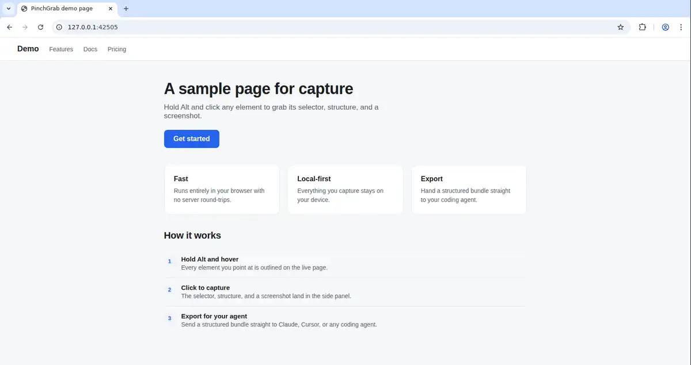

# PinchGrab

> alt+click what's wrong, note it inline, export a bundle your agent can act on.

[](https://github.com/wranngle/pinchgrab/actions/workflows/ci.yml) [](LICENSE) 

> [!NOTE]
> Active personal project. Used in my own workflow. Issues triaged on a personal-time cadence.

## Quick start

```bash
git clone https://github.com/wranngle/pinchgrab && cd pinchgrab
bun install
bun run build
```

Load the generated extension:

1. Open `edge://extensions` or `chrome://extensions`.
2. Enable Developer mode.
3. Click **Load unpacked**.
4. Select the repo's `extension/` folder.
5. Pin PinchGrab, open a page, then hold `Alt` to inspect and `Alt+Click` to capture.

## What it does

Instead of screenshotting a broken page and describing it by hand, you hold Alt, click the element, and say what's wrong in a comment right beside the capture. Each capture pins the exact element for a coding agent: URL, viewport, DOM context, component hints, accessibility signals, event hints, and sanitized HTML. When the critique is done, PinchGrab writes screenshots and the whole per-tab workspace to `Downloads/pinchgrab/<workspace>/` as JSONL, a DuckDB recipe, a screenshot index, README guidance, and a `.tar.zst` bundle an agent can act on directly. A legacy CLI surface adds replay, visual diffs, network replay, step annotations, and export to Playwright, Puppeteer, or plain-English recipes.

## Commands

Day to day you rebuild the extension, prove it still works, and serve pages to capture against:

```bash
bun run build       # rebuild extension/ from src/ (scripts/build-extension.ts)
bun run test        # full suite: build, static checks, every spec, legacy CLI tests
bun run test:fast   # same coverage minus legacy, specs run in parallel
bun run devserver   # local static server (scripts/static-server.mjs)
```

When you changed one thing, check one thing:

```bash
bun run typecheck        # tsc --noEmit
bun run lint             # xo
bun run test:extension   # extension spec only
bun run test:exports     # export spec only
bun run test:legacy      # schema, replay, export, visual-diff, network-replay, annotator tests
```

The legacy CLI keeps one entry point per replay and export utility, covering Playwright and Puppeteer script export, plain-English recipes, visual diffs, network capture, and step annotations:

```bash
bun run replay
bun run replay:multi
bun run export:playwright
bun run export:puppeteer
bun run export:english
bun run visual-diff
bun run network-capture
bun run annotator
```

## Export shape

The extension emits newline-delimited JSON with a manifest row followed by page, selector, and feedback rows. Workspace archives add:

- `README.md`
- `repair-index.md`
- `<workspace>.jsonl`
- `screenshots.json`
- `duckdb.sql`
- `schema.json`
- screenshot PNGs when available
- bundled PinchGrab skill/design context

The older standalone capture schema lives at [docs/capture-schema.json](docs/capture-schema.json), with samples in [docs/capture-sample.jsonl](docs/capture-sample.jsonl).

## Project layout

- `src/` TypeScript extension source.
- `extension/` generated unpacked browser extension.
- `tests/` Playwright, export, extension, framework-tour, and legacy CLI tests.
- `scripts/` build and repo automation.
- `.agents/` dogfooded agent skills and design context.
- `lib/` dotfiles-managed local orchestration libraries.

## License

See [LICENSE](LICENSE).
