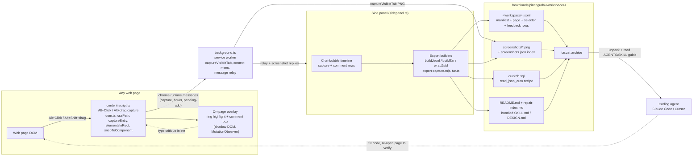

<div align="center">
<picture>
  <source media="(prefers-color-scheme: dark)" srcset="docs/brand/pinchgrab-wordmark-dark.png">
  <source media="(prefers-color-scheme: light)" srcset="docs/brand/pinchgrab-wordmark-light.png">
  
</picture>

#### element capture · inline review comments · per-tab workspaces · agent-ready export bundles · replay and visual-diff CLI

# Hand your AI coding agent the exact element

**[Quick start](#-quick-start) | [Features](#-features) | [AI coding agents](#-ai-coding-agents-claude-code-cursor-codex) | [Privacy](docs/PRIVACY.md) | [Deployment guide](docs/BROWSER-EXTENSION-DEPLOYMENT.md) |**

**❤️ [Sponsor this project](https://github.com/sponsors/wranngle) ❤️**

[](LICENSE)
[](https://github.com/wranngle/pinchgrab/releases)
[](https://github.com/wranngle/pinchgrab/actions/workflows/ci.yml)
[](https://github.com/wranngle/pinchgrab/commits/main)
[](https://github.com/wranngle/pinchgrab/graphs/contributors)

[](https://github.com/wranngle/pinchgrab/stargazers)
[](https://github.com/wranngle)
</div>

---


Instead of screenshotting a broken page and describing it by hand, you hold Alt, click the element, and say what's wrong in a comment right beside the capture. Each capture pins the exact element for a coding agent: URL, viewport, DOM context, component hints, accessibility signals, event hints, and sanitized HTML. When the critique is done, **PinchGrab** writes screenshots and the whole per-tab workspace to `Downloads/pinchgrab/<workspace>/` as JSONL, a DuckDB recipe, a screenshot index, README guidance, and a `.tar.zst` bundle an agent can act on **directly**.

PinchGrab exports stick to boring, open formats: newline-delimited JSON you can query with DuckDB, PNG screenshots with a JSON index, and a JSON-Schema for every row type. Each `.tar.zst` bundle carries its own `README.md`, a `repair-index.md` triage list, and bundled skill and design context, so a coding agent can orient itself without ever seeing this repo.

## ⚡ Features


- 🎯 **Alt+Click capture**: hold `Alt` to outline any element on the live page, click to capture its selectors, DOM breadcrumb, computed styles, accessibility tree, and framework component hints in one record.

- 💬 **Inline comments**: say what's wrong in plain English right beside the capture; every note stays paired to the exact element it describes, screenshot included.

- 🗂️ **Per-tab workspaces**: each tab you activate gets its own workspace, so you can critique several sites at once without mixing feedback.

- 📦 **Export bundle**: one click writes the whole workspace to `Downloads/pinchgrab/<workspace>/` as JSONL, full-resolution screenshots, a `screenshots.json` index, `schema.json`, DuckDB recipes, and a single `.tar.zst` archive.

- 🤖 **Agent handoff**: every bundle ships a `repair-index.md` punch list plus its own README, skill, and design context, so Claude Code, Cursor, or any coding agent can start fixing without extra prompting.

- 🔁 **Legacy replay and diff CLI**: replay captures, generate visual diffs, replay network activity, annotate steps, and export to Playwright, Puppeteer, or plain-English recipes.

- 📸 **Store-grade screenshot tooling**: [`scripts/capture-store-shots.ts`](scripts/capture-store-shots.ts) composes the Chrome Web Store listing set from real panel captures, so listing assets regenerate from source instead of rotting.

## 🚀 Quick start



### Step 1: Clone and build

1. Clone the repository

   Open your terminal and run:

   ```bash
   git clone https://github.com/wranngle/pinchgrab && cd pinchgrab
   ```

2. Install dependencies and build the extension

   ```bash
   bun install
   bun run build
   ```

> PinchGrab is not on the Chrome Web Store yet; until the listing is live, you load the built extension unpacked. The full store path lives in the [deployment guide](docs/BROWSER-EXTENSION-DEPLOYMENT.md) and the [submission checklist](docs/RELEASE-CHECKLIST-CWS.md). A packaged zip ships with each [release](https://github.com/wranngle/pinchgrab/releases).

### Step 2: Load the extension

1. Open `edge://extensions` or `chrome://extensions`.
2. Enable Developer mode.
3. Click **Load unpacked**.
4. Select the repo's `extension/` folder.
5. Pin PinchGrab, open a page, then hold `Alt` to inspect and `Alt+Click` to capture.

### Step 3: Make your first capture

1. Hold `Alt` to outline elements, then `Alt+Click` the one that's wrong.
2. Type what's wrong in the comment box right beside the element.
3. Export the workspace from the side panel when the critique is done.

Everything lands under your Downloads folder:

| Artifact | Path |
| --- | --- |
| Workspace bundle | `Downloads/pinchgrab/<workspace>/<workspace>.tar.zst` |
| Raw capture stream | `Downloads/pinchgrab/<workspace>/<workspace>.jsonl` |
| Screenshots | `Downloads/pinchgrab/<workspace>/screenshots/` plus a `screenshots.json` index |

> 💡 Info: every row type in the stream is described by a JSON-Schema. The older standalone capture schema lives at [docs/capture-schema.json](docs/capture-schema.json), with samples in [docs/capture-sample.jsonl](docs/capture-sample.jsonl).

#### Example

---

<details>
  <summary>What one capture row looks like (real row from <code>docs/capture-sample.jsonl</code>)</summary>

  ```json
  {"schema":"selector-capture-entry","version":3,"sequence":1,"capturedAt":"2026-05-14T17:02:11.482Z","page":{"title":"Pricing — Acme","url":"https://acme.test/pricing","origin":"https://acme.test","protocol":"https:","path":"/pricing","search":"","hash":"","route":"/pricing","viewport":{"width":1440,"height":900,"devicePixelRatio":2,"colorScheme":"light","reducedMotion":false},"scroll":{"x":0,"y":240},"language":"en","direction":"ltr","charset":"UTF-8","documentState":"complete","referrer":"https://acme.test/","contentType":"text/html"},"selectors":{"compact":"button[data-testid=cta-upgrade]","css":"main > section.pricing > div.plan--pro > button[data-testid=\"cta-upgrade\"]","xpath":"//main/section[2]/div[2]/button","jsPath":"document.querySelector(\"[data-testid='cta-upgrade']\")","domPath":["main","section.pricing","div.plan--pro","button"],"siblingIndex":3,"nodeIndex":0,"id":null,"classes":["btn","btn--primary"],"dataIds":"cta-upgrade"},"componentRoot":{"compact":"section.pricing","css":"main > section.pricing","xpath":"//main/section[2]","tag":"section","id":null,"role":null,"testId":null,"classes":["pricing"]},"component":{"framework":"react","componentName":"UpgradeButton","componentDisplayName":"UpgradeButton","source":{"file":"src/components/UpgradeButton.tsx","line":42,"column":4},"props":{"variant":"primary","planId":"pro_monthly"},"state":null,"hooks":null},"element":{"tag":"button","id":null,"classes":["btn","btn--primary"],"name":null,"testId":"cta-upgrade","role":null,"type":"button","title":null,"alt":null,"href":null,"src":null,"target":null,"placeholder":null,"aria":{"aria-label":"Upgrade to Pro"},"value":null,"text":"Upgrade to Pro","accessibleName":"Upgrade to Pro","accessibility":{"computed":{"explicitRole":null,"explicitName":"Upgrade to Pro","computedRole":"button","ariaLive":null,"ariaChecked":null,"ariaExpanded":null,"ariaSelected":null,"tabIndex":0,"labelledBy":null,"describedBy":null,"hasPopup":null,"level":null,"controls":null},"nativeSnapshot":null},"isInteractive":true,"isEditable":false,"isDisabled":false,"isRequired":false,"validation":{"minLength":null,"maxLength":null,"min":null,"max":null},"relation":{"parent":{"tag":"div","id":null,"role":null},"siblingIndex":3,"childElementCount":0,"nodeIndex":0,"previousSibling":"p.plan__blurb","nextSibling":null},"dataset":{"testid":"cta-upgrade","plan":"pro"},"attrs":{"class":"btn btn--primary","data-testid":"cta-upgrade","data-plan":"pro","type":"button"},"outerHTML":"<button class=\"btn btn--primary\" data-testid=\"cta-upgrade\" data-plan=\"pro\" type=\"button\">Upgrade to Pro</button>","outerHTMLLength":108,"rect":{"x":612,"y":488,"width":196,"height":44,"top":488,"left":612,"right":808,"bottom":532},"bounds":{"viewportRect":{"x":612,"y":488,"width":196,"height":44,"top":488,"left":612,"right":808,"bottom":532},"screenRect":{"x":612,"y":728},"offsetSize":{"width":196,"height":44},"clientSize":{"width":196,"height":44},"scroll":{"left":0,"top":240},"viewport":{"width":1440,"height":900},"isInViewport":true,"partiallyVisible":false}},"styles":{"computed":{"color":"rgb(255, 255, 255)","background-color":"rgb(255, 95, 0)","font-size":"15px","font-weight":"600","border-radius":"4px","padding":"10px 18px"},"computedTail":{"display":"inline-flex","cursor":"pointer"},"customProperties":{"--brand-orange":"#ff5f00"},"pseudoStyles":{"before":{},"after":{},"marker":{}},"boxModel":{"width":"196px","height":"44px","minWidth":"0px","minHeight":"0px","maxWidth":"none","maxHeight":"none","margin":{"marginTop":"0px","marginRight":"0px","marginBottom":"0px","marginLeft":"0px"},"padding":{"paddingTop":"10px","paddingRight":"18px","paddingBottom":"10px","paddingLeft":"18px"},"border":{"borderTopWidth":"0px","borderRightWidth":"0px","borderBottomWidth":"0px","borderLeftWidth":"0px"}},"inlineStyle":{},"matchedRules":[{"selector":".btn--primary","specificity":null,"declarations":{"background-color":"rgb(255, 95, 0)","color":"rgb(255, 255, 255)"},"media":"","source":{"styleSheetHref":"https://acme.test/static/app.css","styleSheetType":"LINK","styleSheetId":null,"media":null,"origin":"author","selectorText":".btn--primary","ruleIndex":"42","sourceLine":null,"cssText":".btn--primary { background-color: #ff5f00; color: #ffffff; }","hasStyleText":true},"declarationPriority":[],"isInlineStyleRule":false,"selectorText":".btn--primary"}]},"states":{"hover":false,"focus":false,"focus-visible":false,"active":false,"checked":false,"disabled":false,"required":false,"invalid":false,"isVisible":true,"isEnabled":true},"events":{"inline":{},"propertyAssigned":[{"type":"onclick","assigned":true,"handlerName":"handleUpgradeClick"}],"devtoolsListeners":null,"handlerPropNames":[]},"domBreadcrumb":[{"depth":1,"tag":"html","compact":"html","id":null,"role":null,"classes":[]},{"depth":2,"tag":"body","compact":"body","id":null,"role":null,"classes":[]},{"depth":3,"tag":"main","compact":"main","id":null,"role":null,"classes":[]},{"depth":4,"tag":"section","compact":"section.pricing","id":null,"role":null,"classes":["pricing"]},{"depth":5,"tag":"div","compact":"div.plan--pro","id":null,"role":null,"classes":["plan--pro"]},{"depth":6,"tag":"button","compact":"button[data-testid=cta-upgrade]","id":null,"role":null,"classes":["btn","btn--primary"],"testId":"cta-upgrade"}],"notes":{"url":"https://acme.test/pricing"},"feedback":""}
  ```

  This is a single newline-delimited row: one Alt+Click on a pricing-page button, carrying its selectors, React component source hints, accessibility tree, computed styles, and matched CSS rules. An agent (or DuckDB) reads the stream one row at a time; the full schema lives at [docs/capture-schema.json](docs/capture-schema.json).

</details>

---

<details>
  <summary>Export shape: what a workspace archive contains</summary>

  The extension emits newline-delimited JSON with a manifest row followed by page, selector, and feedback rows. Workspace archives add:

  - `README.md`
  - `repair-index.md`
  - `<workspace>.jsonl`
  - `screenshots.json`
  - `duckdb.sql`
  - `schema.json`
  - screenshot PNGs when available
  - bundled PinchGrab skill/design context

</details>

---

### Step 4: Rebuild, test, and iterate

Day to day you rebuild the extension, prove it still works, and serve pages to capture against:

```bash
bun run build       # rebuild extension/ from src/ (scripts/build-extension.ts)
bun run test        # full suite: build, static checks, every spec, legacy CLI tests
bun run test:fast   # same coverage minus legacy, specs run in parallel
bun run devserver   # local static server (scripts/static-server.mjs)
```

When you changed one thing, check one thing:

```bash
bun run typecheck        # tsc --noEmit
bun run lint             # xo
bun run test:extension   # extension spec only
bun run test:exports     # export spec only
bun run test:legacy      # schema, replay, export, visual-diff, network-replay, annotator tests
```

The legacy CLI keeps one entry point per replay and export utility, covering Playwright and Puppeteer script export, plain-English recipes, visual diffs, network capture, and step annotations:

```bash
bun run replay
bun run replay:multi
bun run export:playwright
bun run export:puppeteer
bun run export:english
bun run visual-diff
bun run network-capture
bun run annotator
```


*Store listing frames, composed from real extension UI by [`scripts/capture-store-shots.ts`](scripts/capture-store-shots.ts).*

## 🤖 AI Coding Agents (Claude Code, Cursor, Codex)

Every `.tar.zst` export is built to be handed to a **coding agent** as-is. There is no plugin to install and no API between you and the bundle; anything that can read files can consume one.

### Extract the bundle

```bash
tar --zstd -xf <workspace>.tar.zst   # unpack next to (or inside) the project the feedback is about
```

### Point your agent at the folder

The bundle's own `README.md` sends the agent to `repair-index.md` first, then to the bundled skill and design context. No extra prompting is required beyond "read this folder and fix what it describes".

### Work the repair index

`repair-index.md` turns each comment into a task: the complaint verbatim, the target selector and uid, the screenshot path, framework component and source-file hints when detected, and a heuristic fix category (copy, layout, accessibility, state, visual polish). The agent cross-references the JSONL stream and `screenshots/` for full detail, makes the fix, and verifies against the captured before-state.

> Every bundle is self-describing: newline-delimited JSON rows with a bundled `schema.json`, PNG screenshots with a JSON index, and a DuckDB recipe for ad-hoc queries. Claude Code, Cursor, and Codex CLI all read it the same way, and so does anything else that can open files. PinchGrab has no server side; the bundle is the whole interface.

## 📦 Supported Integrations

Bundles are plain files, so the integrations are simply the tools that read and produce them. "Consumer" here means the tool reads the exported files; no partnership or plugin is implied. Click any card to jump to the matching section.

<sub>
 reads exported bundles &nbsp;&nbsp;
 written by the legacy CLI
</sub>

### Bundle consumers

<table>
<tr>
<td align="center" width="160"><a href="#-ai-coding-agents-claude-code-cursor-codex"><b>Claude Code</b></a><br/></td>
<td align="center" width="160"><a href="#-ai-coding-agents-claude-code-cursor-codex"><b>Cursor</b></a><br/></td>
<td align="center" width="160"><a href="#-ai-coding-agents-claude-code-cursor-codex"><b>Codex CLI</b></a><br/></td>
<td align="center" width="160"><a href="#example"><b>DuckDB</b></a><br/></td>
</tr>
</table>

### Export targets

<table>
<tr>
<td align="center" width="160"><a href="#step-4-rebuild-test-and-iterate"><b>Playwright</b></a><br/></td>
<td align="center" width="160"><a href="#step-4-rebuild-test-and-iterate"><b>Puppeteer</b></a><br/></td>
<td align="center" width="160"><a href="#step-4-rebuild-test-and-iterate"><b>Plain-English recipes</b></a><br/></td>
<td align="center" width="160"><a href="#-ai-coding-agents-claude-code-cursor-codex"><b>tar.zst bundle</b></a><br/></td>
</tr>
</table>

## 🛣️ Roadmap

What has shipped and what is next:

| Feature | Status |
| --- | --- |
| [Alt+Click element capture with inline comments](src/content-script.ts) | ✅ Completed |
| [Per-tab workspaces and `.tar.zst` export bundles](src/sidepanel.ts) | ✅ Completed |
| [Legacy replay, visual-diff, and script-export CLI](#step-4-rebuild-test-and-iterate) | ✅ Completed |
| [Store screenshot pipeline from real panel captures](scripts/capture-store-shots.ts) | ✅ Completed |
| [First packaged release (v1.1.2, zip attached)](https://github.com/wranngle/pinchgrab/releases/tag/v1.1.2) | ✅ Completed |
| [Chrome Web Store listing (submission packaged, operator account steps remain)](docs/RELEASE-CHECKLIST-CWS.md) | 🔜 Coming Soon |
| [Microsoft Edge Add-ons listing (same zip, after CWS)](docs/BROWSER-EXTENSION-DEPLOYMENT.md) | 🔜 Coming Soon |

## 🌱 Contributing

Big or small, contributions are welcome 💚. Bugs, capture edge cases, and export-format questions go to [GitHub Issues](https://github.com/wranngle/pinchgrab/issues). Pull requests are welcome too; run `bun run test` before opening one.

Getting oriented: extension source lives in `src/`, the generated unpacked extension in `extension/`, tests in `tests/`, and build automation in `scripts/`.

## 💚 Community & Support

- 🌟 If PinchGrab is useful, leave a star on [GitHub](https://github.com/wranngle/pinchgrab).
- 🐞 Report bugs and capture edge cases on [GitHub Issues](https://github.com/wranngle/pinchgrab/issues).
- 📦 Grab the packaged extension zip from the [latest release](https://github.com/wranngle/pinchgrab/releases/latest).
- 💜 If PinchGrab saves you a screenshot-and-describe round trip, consider [sponsoring this project](https://github.com/sponsors/wranngle).

> [!NOTE]
> Active personal project. Used in my own workflow. Issues triaged on a personal-time cadence.

## License

PinchGrab is available under the [MIT License](LICENSE).

## 💻 Contributors

<a href="https://github.com/wranngle/pinchgrab/graphs/contributors">
  
</a>

## ⭐ Star History

[](https://www.star-history.com/#wranngle/pinchgrab&Date)
